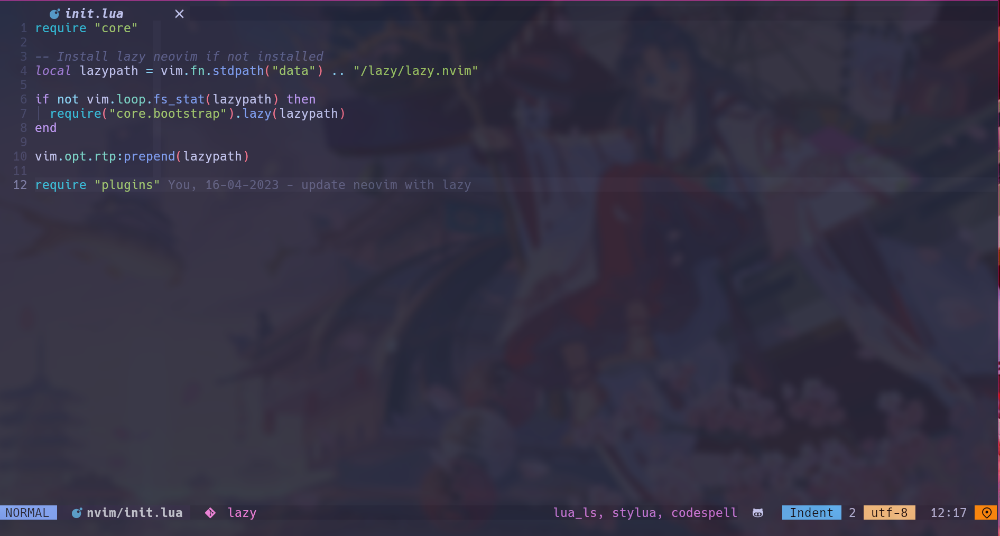
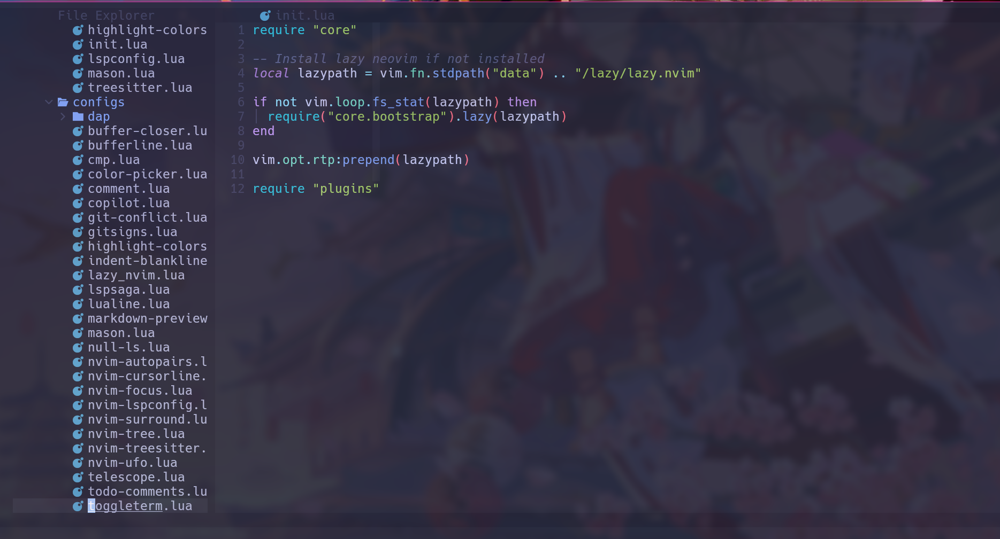
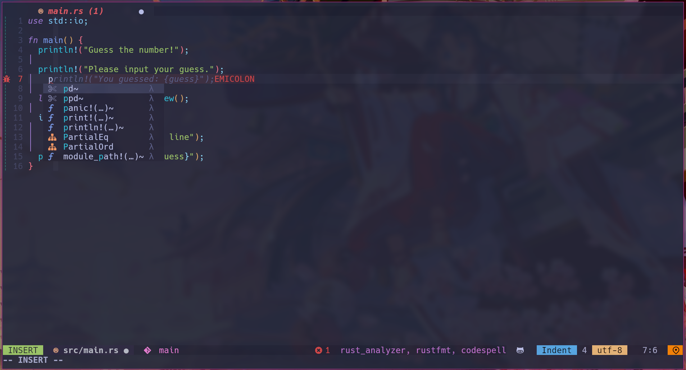
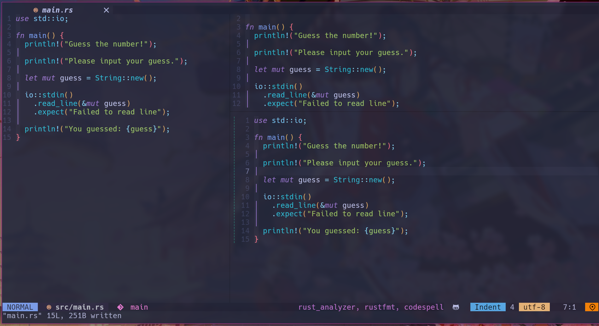

## Neovim Config

This is my personal neovim configuration, written completely in Lua.It uses a lazy plugin manager to ensure fast startup times, even with a large number of plugins installed.

## Preview









## Plugins

- **[lazy](https://github.com/folke/lazy.nvim):** Uses a lazy plugin manager to ensure fast startup times.

- **[copilot](https://github.com/zbirenbaum/copilot.lua):** Enables support for OpenAI's Copilot.

- **[nvim-cmp](https://github.com/hrsh7th/nvim-cmp):** Provides autocomplete functionality using nvim-cmp,
  a lightweight completion plugin.

- **[nvim-lspconfig](https://github.com/neovim/nvim-lspconfig):** Implements Language Server Protocol (LSP)
  support using nvim-lspconfig, a simple interface for configuring language servers.

- **[null-ls](https://github.com/jose-elias-alvarez/null-ls.nvim):** Enables automatic formatting with null-ls,
  a plugin that allows using external formatters as Neovim plugins.

- **[mason](https://github.com/williamboman/mason.nvim):** Automatically installs LSP servers,
  formatters, linters, and debug adapters using Mason, a Neovim plugin manager.

- **[nvim-tree](https://github.com/nvim-tree/nvim-tree.lua):** Includes a file explorer using nvim-tree,
  a fast and lightweight file explorer plugin.

- **[gitsigns](https://github.com/lewis6991/gitsigns.nvim),
  [git-conflict](https://github.com/akinsho/git-conflict.nvim):** Integrates Git functionality
  with gitsigns and git-conflict plugins for a seamless Git experience.

- **[telescope](https://github.com/nvim-telescope/telescope.nvim):** Provides a file finder using telescope,
  a fuzzy finder plugin for files, buffers, and more.

- **[bufferline](https://github.com/akinsho/bufferline.nvim):** Manages buffers with bufferline,
  a simple and configurable interface for buffer management.

- **[lualine](https://github.com/nvim-lualine/lualine.nvim):** Displays a statusline using lualine,
  a fast and lightweight statusline plugin with customizable options.

- **[toggleterm](https://github.com/akinsho/toggleterm.nvim):** Includes a terminal using toggleterm,
  a plugin for managing terminals within Neovim.

- **[nvim-ufo](https://github.com/kevinhwang91/nvim-ufo):** Supports folding functionality with nvim-ufo,
  a lightweight folding plugin.

- **[comment](https://github.com/numToStr/Comment.nvim):** Includes a plugin for easily generating comments.

- **[treesitter](https://github.com/nvim-treesitter/nvim-treesitter),
  [autopairs](https://github.com/windwp/nvim-autopairs),
  [nvim-ts-autotag](https://github.com/windwp/nvim-ts-autotag),
  [rainbow-delimiters](https://github.com/HiPhish/rainbow-delimiters.nvim)** Provides syntax
  highlighting using Treesitter, Autopairs, Nvim-ts-autotag, and Ts-rainbow plugins.

- **[dap](https://github.com/mfussenegger/nvim-dap), [dapui](https://github.com/rcarriga/nvim-dap-ui):**
  Offers debugging capabilities with dap and dapui plugins.

- **[buffer-closer](https://github.com/sontungexpt/buffer-closer):** Automatically closes
  unused buffers using buffer-closer, a plugin for managing buffers.

- **[ccc](https://github.com/uga-rosa/ccc.nvim):** Includes a color picker using ccc,
  a fast and lightweight color picker plugin

- **[focus](https://github.com/sontungexpt/focus.nvim):** Automatically resizes windows
  based on focus using a dedicated plugin.

- **[url-open](https://github.com/sontungexpt/url-open):** Open the url under cursor.

- And more... dependencies are listed in the plugins/init.lua file.

## Requirements

- xclip (for clipboard support)
- fd (for telescope)

```bash
sudo pacman -S xclip fd
```

## Installation

To use this configuration, you will need to have Neovim 0.5 or higher installed. You can then clone this repository and copy the init.lua file to your ~/.config/nvim/ directory.

```bash
[ -d ~/.config/nvim ] && mv ~/.config/nvim ~/.config/nvim.bak ; git clone https://github.com/sontungexpt/neovim-config.git ~/.config/nvim
```

You will also need to install the plugins. This configuration uses the lazy.nvim plugin manager to manage plugins. You can install the plugins by opening Neovim and running :Lazy.

```vim
:Lazy
```

## Inspiration

- [NvChad](https://github.com/NvChad/NvChad)

## Configuration

This configuration is highly customizable and easy to configure. You can customize the configuration by modifying the init.lua file.

## Contributions

If you find any issues with this configuration or would like to contribute, please feel free to submit a pull request or open an issue.

## License

This configuration is released under the MIT License.
