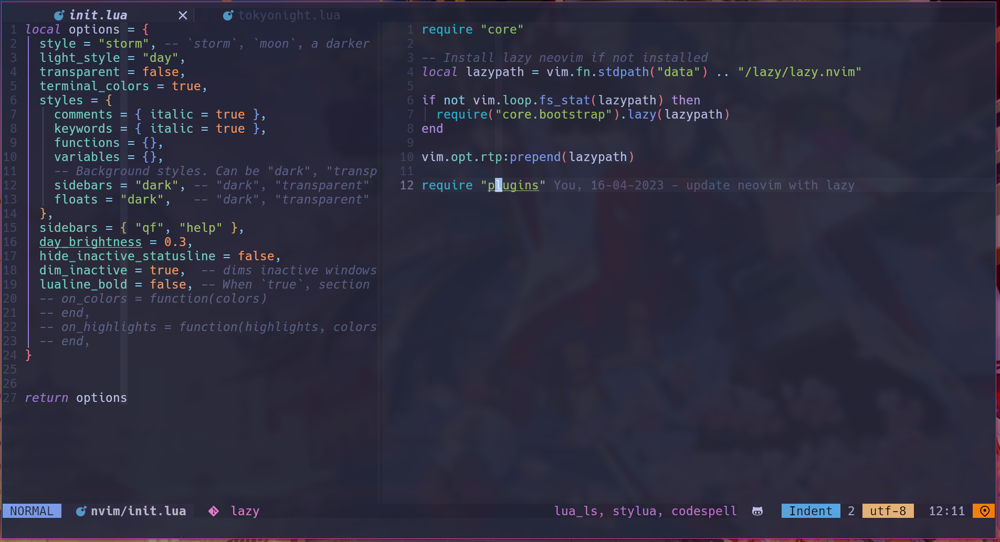

## Neovim Config

This is my personal neovim configuration, written completely in Lua. It uses a lazy plugin manager to ensure fast startup times, even with a large number of plugins installed.

## Preview




## Features

- **Lazy Plugin Manager:** The configuration uses a lazy plugin manager to ensure fast startup times, even with a large number of plugins installed.

- **Support for Copilot:** You can use OpenAI's Copilot with this configuration.

- **Autocomplete with nvim-cmp:** It supports autocomplete with nvim-cmp, a fast and lightweight completion plugin.

- **LSP with nvim-lspconfig:** It supports Language Server Protocol (LSP) with nvim-lspconfig, which provides a simple and easy-to-use interface for configuring language servers.

- **Autoformat with null-ls:** It supports autoformatting with null-ls, a plugin that allows you to use any external formatter as a Neovim plugin.

- **Auto Install LSP Server, Formatter, Linter, Debug Adapter with Mason:** It automatically installs LSP servers, formatters, linters, and debug adapters using Mason, a plugin manager for Neovim.

- **File Explorer with nvim-tree:** It includes a file explorer with nvim-tree, a fast and lightweight file explorer plugin.

- **Git with gitsigns, git-conflict:** It includes Git integration with gitsigns and git-conflict, two plugins that provide easy-to-use Git functionality.

- **Finder with telescope:** It includes a file finder with telescope, a plugin that provides a fuzzy finder for files, buffers, and more.

- **Bufferline with bufferline:** It includes a bufferline with bufferline, a plugin that provides a simple and configurable interface for managing buffers.

- **Statusline with lualine:** It includes a statusline with lualine, a fast and lightweight statusline plugin that provides a wide range of customization options.

- **Terminal with toggleterm:** It includes a terminal with toggleterm, a plugin that provides a simple and easy-to-use interface for managing terminals.

- **Fold with nvim-ufo:** It supports folding with nvim-ufo, a plugin that provides fast and lightweight folding functionality.

- **Generate comment with comment:** It includes a plugin that provides easy-to-use commenting functionality.

- **Syntax Highlight with Treesitter, Autopairs, Nvim-ts-autotag, Ts-rainbow:** It includes syntax highlighting with Treesitter, Autopairs, Nvim-ts-autotag, and Ts-rainbow, four plugins that provide fast and lightweight syntax highlighting functionality.

- **Debug with dap, dapui:** It includes debugging support with dap and dapui, two plugins that provide a wide range of debugging functionality.

- **Automatically Close Unused Buffers with Buffer-closer:** It automatically closes unused buffers with buffer-closer, a plugin that provides a simple and easy-to-use interface for managing buffers.

- **Color Picker with ccc:** It includes a color picker with ccc, a fast and lightweight color picker plugin.

- **Automatically resize Window with focus:** It automatically resizes windows with focus, a plugin that provides a simple and easy-to-use interface for resizing windows.

## Installation

To use this configuration, you will need to have Neovim 0.5 or higher installed. You can then clone this repository and copy the init.lua file to your ~/.config/nvim/ directory.

```bash
mv ~/.config/nvim ~/.config/nvim.bak && git clone
https://github.com/sontungexpt/neovim-config.git && mv neovim-config ~/.config/nvim
```

You will also need to install the plugins. This configuration uses the lazy.nvim plugin manager to manage plugins. You can install the plugins by opening Neovim and running :Lazy.

```vim
:Lazy
```

## Configuration

This configuration is highly customizable and easy to configure. You can customize the configuration by modifying the init.lua file.

## Contributions

If you find any issues with this configuration or would like to contribute, please feel free to submit a pull request or open an issue.

## License

This configuration is released under the MIT License.
